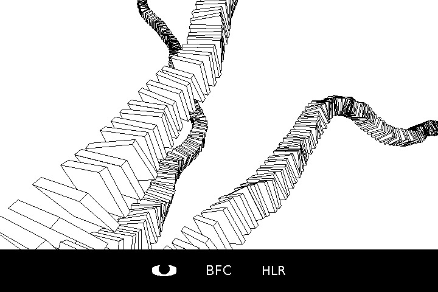

# Ostrich



A 3D engine that renders wireframe models, coupled with a custom script interpreter to generate them. It can perform hidden-line removal to render solid 3D models, and export images as bitmap files for further processing. It features:

- 3D rotation and translation
- Variable focal length
- Back-face culling
- Frustum clipping
- Frustum culling
- Hidden-line removal (slow)
- Image export
- Model generation using a custom scripting language

This is a learning project I made for [December Adventures](https://eli.li/december-adventure) 2023. I wanted to practice coding in C, so I started writing a 3D projector inspired by [moogle](https://wiki.xxiivv.com/site/moogle.html) and [pinhole](https://git.sr.ht/~bellinitte/pinhole).

The resulting program implements various optimization techniques, as well as [back-face culling](https://en.wikipedia.org/wiki/Back-face_culling) and [hidden-line removal](https://en.wikipedia.org/wiki/Hidden-line_removal) for rendering solid models. On the last few days I tried to implement a custom scripting language for generating 3D models *à la OpenSCAD*, but the result is very limited. There's also some code for importing STL files, but it ended up not using it.

You can read the full log on [my website](https://ghettobastler.com/december_adventure_2023.html).

## Building

```
make ostrich
```

## Usage

```
ostrich path_to_script_file
```

The program uses the keyboard and mouse to move around 3D space:

- Left click: rotate around the X/Y axis
- Right click: rotate around the Z axis
- Shift + left click: drag the model
- W/A/S/D: Move forward/left/back/right
- Q: Move up
- E: Move down
- O: toggle camera mode
- T: reload the script file
- R: trigger hidden-line removal
- B: toggle back-face culling
- Space: export current view as a BMP file

# Input script

The interpreter recognizes 16 keywords and uses [Reverse Polish Notation](https://en.wikipedia.org/wiki/Reverse_Polish_notation).

## Examples


```
15 5 20 prism
```


```
15 5 20 prism
clone
0 0 1 reflect
merge
```


```
15 3 10 prism
clone
0 0 15 rotate
0 0 25 translate
clone
0 0 15 rotate
0 0 25 translate
clone
0 0 15 rotate
0 0 25 translate
clone
0 0 15 rotate
0 0 25 translate
merge
merge
merge
merge
```

## Scripting language

The interpreter uses two stacks that serves different purposes:

- The **work stack** stores floating point numbers and is used for arithmetic operations.
- The **object stack** stores pointers to 3D meshes. These are generated using functions that take their parameters from the work stack.

The language does not have any control structures, and there is no way to create new commands.

### 3D primitives

There are currently two supported 3D primitives: regular prisms and cuboids. In both cases, parameters are popped from the **work stack**, and a pointer to the generated solid is pushed onto the **object stack**.

- radius sides height **prism**: create a regular prism
- a b c **box**: creates a rectangular cuboid

### 3D transforms

As with primitives, 3D transforms consume arguments from the **work stack** and modify the meshes placed at the top of the **object stack**.

- x y z **translate**: translate the 3D model at the top of the object stack
- x y z **rotate**: rotate the 3D model at the top of the object stack
- x y z **reflect**: reflect the 3D model at the top of the object stack through a plane that pass through the origin, with normal vector (x,y,z)
- **merge**: merge the two top-most models in the object stack into one
- **clone**: copy the mesh at the top of the object stack. A new pointer is pushed onto the object stack

### Stack manipulation

Elements in the stack can be moved around using these commands:

- **dup_work** and **dup_obj** duplicate the top-most element of the work stack and object stack respectively
- **rot_work** and **rot_obj** rotate the top-most elements of the work stack/object stack (x y z -> z x y)

### Number stuff

The work stack supports the following arithmetic operations:

- **add** pop the two top-most values of the work stack and pushes their sum
- **sub** pop the two top-most values of the work stack and pushes their difference
- **mul** pop the two top-most values of the work stack and pushes their product
- **div** pop the two top-most values of the work stack and pushes their quotient
- **rand** pop a min and max values from the work stack and pushes a random float between min and max

## Licensing

The code for this project is licensed under the terms of the GNU GPLv3 license.
